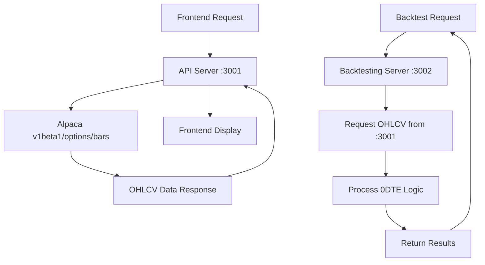

# API MAPPING AGENT
## Comprehensive Frontend-Backend Communication Analysis

### Agent Mission
Map all API calls between the React frontend and Docker backend containers, ensuring proper data flow for 0-1 DTE options backtesting with OHLCV data handling.

### Architecture Overview

#### Container Structure
```
┌─────────────────────────────────────────────────────────────┐
│                    Docker Network                           │
├─────────────────────────────────────────────────────────────┤
│  Frontend (React)    │  API Server         │  Backtesting   │
│  Port: 8080         │  Port: 3001         │  Port: 3002    │
│  (Host Machine)     │  (Docker Container) │  (Docker)      │
└─────────────────────────────────────────────────────────────┘
```

### Critical Discovery: Port Routing Mismatch ⚠️

**Issue Found**: Frontend makes API calls to port 3001, but backtesting server runs on port 3002
**Impact**: Backtesting requests may fail or route incorrectly
**Priority**: HIGH - Must be fixed for proper functionality

### API Endpoint Mapping Analysis

#### 1. Market Data Endpoints

**Frontend Calls**: 
```typescript
// src/integrations/api.ts
const baseURL = 'http://localhost:3001'; // ❌ POTENTIAL MISMATCH

// Stock data fetching
fetch(`${baseURL}/api/stock-data?ticker=${ticker}&period=${period}`)

// Options data fetching  
fetch(`${baseURL}/api/options-data?ticker=${ticker}&expiry=${expiry}`)
```

**Backend Routes (Port 3001)**:
```javascript
// docker/api-server/server.js
app.get('/api/stock-data', async (req, res) => {
  // Routes to Alpaca API for stock OHLCV data
});

app.get('/api/options-data', async (req, res) => {
  // Routes to Alpaca options bars API
  // Uses v1beta1/options/bars endpoint
});
```

**Backtesting Server (Port 3002)**:
```javascript
// docker/backtesting-server/backtesting-engine.js
app.get('/api/backtest', async (req, res) => {
  // Handles strategy backtesting
  // Uses OHLCV data from port 3001 server
});
```

#### 2. WebSocket Connections

**Real-time Data Flow**:
```javascript
// Frontend WebSocket connection
const ws = new WebSocket('ws://localhost:3001/ws');

// Backend WebSocket handler (Port 3001)
wss.on('connection', (ws) => {
  // Streams real-time market data
  // Forwards to backtesting server as needed
});
```

#### 3. Backtesting API Communication

**Current Implementation**:
```typescript
// Frontend backtesting request
fetch('http://localhost:3001/api/backtest', {
  method: 'POST',
  body: JSON.stringify(backtestParams)
});
```

**Required Fix**:
```typescript
// Should route to backtesting server
fetch('http://localhost:3002/api/backtest', {
  method: 'POST', 
  body: JSON.stringify(backtestParams)
});
```

### Data Flow Mapping

#### OHLCV Data Pipeline for 0-1 DTE Options



#### Bid/Ask Estimation Logic

**Current Implementation** (Backtesting Server):
```javascript
// docker/backtesting-server/backtesting-engine.js
function estimateBidAsk(ohlcvData) {
  return {
    bid: ohlcvData.close * 0.95,  // 95% of close
    ask: ohlcvData.close * 1.05   // 105% of close
  };
}
```

**Lambda Class Research Insight**: This estimation is too simplistic for 0DTE options
**Recommended Enhancement**: Implement volatility-based spread calculation

### Port Communication Matrix

| Service | Port | Purpose | Status |
|---------|------|---------|---------|
| Frontend | 8080 | React UI | ✅ Working |
| API Server | 3001 | Main API/WebSocket | ✅ Working |
| Backtesting | 3002 | Strategy Engine | ⚠️ Port Mismatch |

### Required Code Changes

#### 1. Frontend API Configuration

**File**: `src/integrations/api.ts`
```typescript
// Current
const API_BASE_URL = 'http://localhost:3001';

// Required Enhancement
const API_CONFIG = {
  marketData: 'http://localhost:3001',
  backtesting: 'http://localhost:3002',
  websocket: 'ws://localhost:3001/ws'
};

// Route requests appropriately
export const marketDataAPI = axios.create({
  baseURL: API_CONFIG.marketData
});

export const backtestingAPI = axios.create({
  baseURL: API_CONFIG.backtesting
});
```

#### 2. Docker Compose Network Configuration

**File**: `docker-compose.yml`
```yaml
# Verify network configuration allows inter-service communication
services:
  api-server:
    ports:
      - "3001:3001"
    networks:
      - trade-whisperer-network
      
  backtesting-server:
    ports:
      - "3002:3002"
    networks:
      - trade-whisperer-network
    depends_on:
      - api-server

networks:
  trade-whisperer-network:
    driver: bridge
```

#### 3. Backtesting Server Data Requests

**File**: `docker/backtesting-server/backtesting-engine.js`
```javascript
// Ensure backtesting server can request data from API server
const API_SERVER_URL = process.env.API_SERVER_URL || 'http://api-server:3001';

async function fetchMarketData(ticker, period) {
  const response = await fetch(`${API_SERVER_URL}/api/stock-data?ticker=${ticker}&period=${period}`);
  return response.json();
}
```

### API Call Sequence for 0DTE Backtesting

```
1. Frontend → API Server (3001): Get available 0DTE options
2. API Server → Alpaca: Fetch options chain
3. Frontend → Backtesting Server (3002): Start backtest
4. Backtesting Server → API Server (3001): Request OHLCV data
5. API Server → Alpaca: Fetch historical bars
6. Backtesting Server: Process 0DTE logic
7. Backtesting Server → Frontend: Return results
```

### Error Handling & Validation

#### Network Connectivity Checks
```javascript
// Add to both servers
async function healthCheck() {
  try {
    // API Server health check
    const response = await fetch('http://localhost:3001/health');
    if (!response.ok) throw new Error('API Server unavailable');
    
    // Backtesting Server health check  
    const backtestResponse = await fetch('http://localhost:3002/health');
    if (!backtestResponse.ok) throw new Error('Backtesting Server unavailable');
    
    return { status: 'healthy' };
  } catch (error) {
    return { status: 'error', message: error.message };
  }
}
```

#### Data Quality Validation
```javascript
// Validate OHLCV data quality
function validateOHLCVData(data) {
  const validations = [
    data.open > 0,
    data.high >= data.open,
    data.low <= data.open,
    data.close > 0,
    data.volume >= 0
  ];
  
  return validations.every(Boolean);
}
```

### Performance Optimization

#### Caching Strategy
```javascript
// Implement Redis caching for frequently requested data
const redis = require('redis');
const client = redis.createClient();

async function getCachedMarketData(key, fetchFunction) {
  const cached = await client.get(key);
  if (cached) return JSON.parse(cached);
  
  const fresh = await fetchFunction();
  await client.setex(key, 300, JSON.stringify(fresh)); // 5-minute cache
  return fresh;
}
```

#### Connection Pooling
```javascript
// Optimize HTTP connections between services
const http = require('http');
const agent = new http.Agent({
  keepAlive: true,
  maxSockets: 10
});
```

### Security Considerations

#### API Authentication
```javascript
// Add JWT token validation
const jwt = require('jsonwebtoken');

function validateToken(req, res, next) {
  const token = req.headers.authorization?.split(' ')[1];
  try {
    const decoded = jwt.verify(token, process.env.JWT_SECRET);
    req.user = decoded;
    next();
  } catch (error) {
    res.status(401).json({ error: 'Invalid token' });
  }
}
```

#### Rate Limiting
```javascript
// Implement rate limiting for API calls
const rateLimit = require('express-rate-limit');

const limiter = rateLimit({
  windowMs: 15 * 60 * 1000, // 15 minutes
  max: 100 // limit each IP to 100 requests per windowMs
});
```

### Monitoring & Logging

#### Request Tracking
```javascript
// Add request correlation IDs
const { v4: uuidv4 } = require('uuid');

app.use((req, res, next) => {
  req.correlationId = uuidv4();
  console.log(`[${req.correlationId}] ${req.method} ${req.path}`);
  next();
});
```

#### Performance Metrics
```javascript
// Track API response times
const responseTime = require('response-time');

app.use(responseTime((req, res, time) => {
  console.log(`[${req.correlationId}] Response time: ${time}ms`);
}));
```

### Testing Strategy

#### API Integration Tests
```javascript
describe('API Communication Tests', () => {
  test('Frontend can reach API server', async () => {
    const response = await fetch('http://localhost:3001/health');
    expect(response.status).toBe(200);
  });
  
  test('Backtesting server can reach API server', async () => {
    // Test inter-service communication
  });
  
  test('0DTE options data flow works end-to-end', async () => {
    // Test complete data pipeline
  });
});
```

### Action Items for Implementation

#### Immediate (Priority 1)
- [ ] Fix port routing mismatch in frontend configuration
- [ ] Add health check endpoints to both servers
- [ ] Implement proper error handling for service communication
- [ ] Add request correlation IDs for debugging

#### Short-term (Priority 2)  
- [ ] Implement Redis caching for market data
- [ ] Add JWT authentication between services
- [ ] Set up comprehensive logging and monitoring
- [ ] Create API integration test suite

#### Long-term (Priority 3)
- [ ] Implement circuit breaker pattern for service resilience
- [ ] Add API versioning strategy
- [ ] Set up distributed tracing
- [ ] Implement advanced rate limiting

---

*API Mapping Agent Analysis Complete*
*Priority: Fix port communication mismatch immediately*