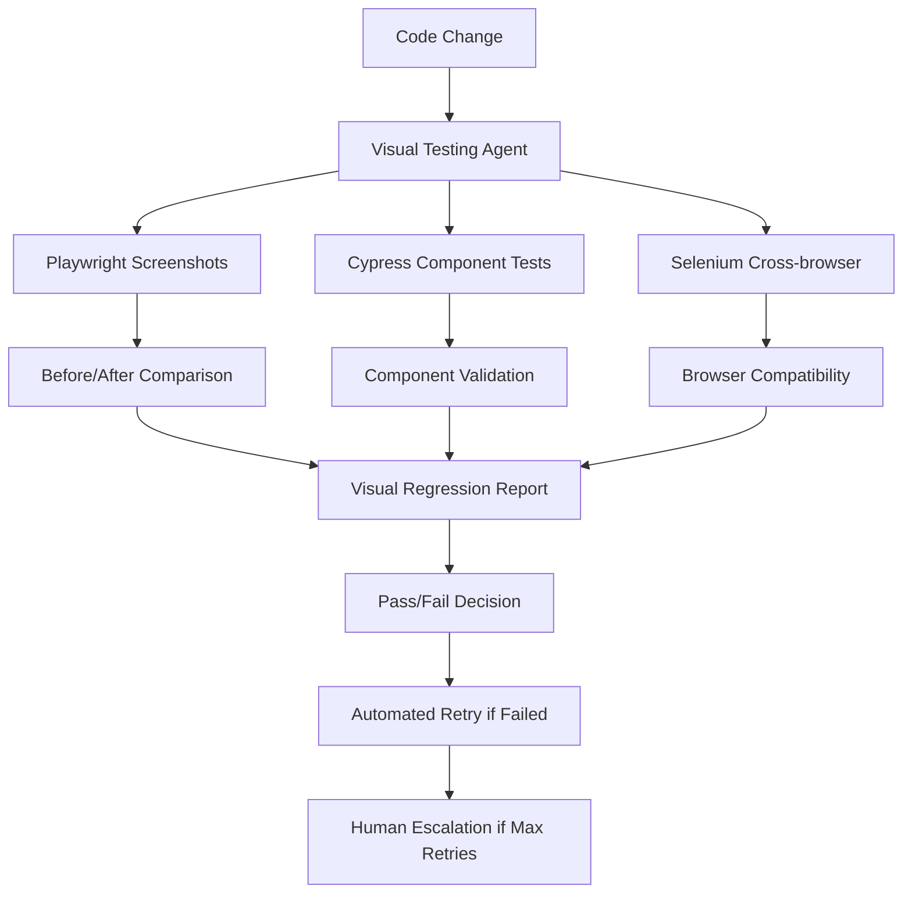

# VISUAL TESTING AUDITOR AGENT
## Automated Screenshot Validation & System Auditing

### Agent Mission
Take comprehensive screenshots after each fix and evaluate system functionality as an automated auditor, ensuring the 0-1 DTE options backtesting system works correctly with real data and proper UI feedback.

### Visual Testing Architecture



### Testing Framework Implementation

#### Playwright Configuration for Trade Whisperer

**File**: `tests/visual-audit/playwright.config.js`
```javascript
const { defineConfig } = require('@playwright/test');

module.exports = defineConfig({
  testDir: './tests/visual-audit',
  fullyParallel: true,
  forbidOnly: !!process.env.CI,
  retries: process.env.CI ? 2 : 0,
  workers: process.env.CI ? 1 : undefined,
  reporter: [
    ['html', { outputFolder: 'visual-test-results' }],
    ['json', { outputFile: 'visual-test-results.json' }]
  ],
  use: {
    baseURL: 'http://localhost:8080',
    screenshot: 'only-on-failure',
    trace: 'on-first-retry',
    video: 'retain-on-failure'
  },
  projects: [
    {
      name: 'chromium',
      use: { ...devices['Desktop Chrome'] },
    },
    {
      name: 'firefox',
      use: { ...devices['Desktop Firefox'] },
    },
    {
      name: 'webkit',
      use: { ...devices['Desktop Safari'] },
    },
    {
      name: 'mobile',
      use: { ...devices['iPhone 12'] },
    }
  ],
  webServer: {
    command: 'npm run dev',
    port: 8080,
    reuseExistingServer: !process.env.CI
  }
});
```

#### Core Visual Test Suite

**File**: `tests/visual-audit/trade-whisperer-audit.spec.js`
```javascript
const { test, expect } = require('@playwright/test');

class TradeWhispererAuditor {
  constructor(page) {
    this.page = page;
    this.screenshotCounter = 0;
  }

  async takeAuditScreenshot(name) {
    this.screenshotCounter++;
    const timestamp = new Date().toISOString().replace(/[:.]/g, '-');
    const filename = `${this.screenshotCounter}-${name}-${timestamp}.png`;
    
    await this.page.screenshot({
      path: `visual-audit-screenshots/${filename}`,
      fullPage: true
    });
    
    console.log(`📸 Audit screenshot taken: ${filename}`);
    return filename;
  }

  async auditLandingPage() {
    await this.page.goto('/');
    await this.page.waitForLoadState('networkidle');
    
    // Check critical elements
    await expect(this.page.locator('h1')).toBeVisible();
    await expect(this.page.locator('[data-testid="trade-whisperer-logo"]')).toBeVisible();
    
    await this.takeAuditScreenshot('landing-page-loaded');
    
    // Validate no console errors
    const logs = [];
    this.page.on('console', msg => logs.push(msg));
    await this.page.reload();
    
    const errors = logs.filter(log => log.type() === 'error');
    expect(errors).toHaveLength(0);
    
    return { status: 'PASS', errors: [] };
  }

  async auditBacktestingInterface() {
    await this.page.goto('/backtest');
    await this.page.waitForLoadState('networkidle');
    
    await this.takeAuditScreenshot('backtest-interface-initial');
    
    // Check form elements
    const tickerInput = this.page.locator('input[name="ticker"]');
    const strategySelect = this.page.locator('select[name="strategy"]');
    const runButton = this.page.locator('button[type="submit"]');
    
    await expect(tickerInput).toBeVisible();
    await expect(strategySelect).toBeVisible();
    await expect(runButton).toBeVisible();
    
    // Test form interaction
    await tickerInput.fill('SPY');
    await strategySelect.selectOption('0DTE');
    
    await this.takeAuditScreenshot('backtest-form-filled');
    
    return { status: 'PASS', errors: [] };
  }

  async auditDataVisualization() {
    await this.page.goto('/backtest');
    
    // Trigger backtest run
    await this.page.fill('input[name="ticker"]', 'SPY');
    await this.page.selectOption('select[name="strategy"]', '0DTE');
    await this.page.click('button[type="submit"]');
    
    await this.takeAuditScreenshot('backtest-initiated');
    
    // Wait for results
    await this.page.waitForSelector('[data-testid="backtest-results"]', { timeout: 30000 });
    
    await this.takeAuditScreenshot('backtest-results-loaded');
    
    // Validate charts and data tables
    const chart = this.page.locator('[data-testid="performance-chart"]');
    const tradeHistory = this.page.locator('[data-testid="trade-history"]');
    const metricsPanel = this.page.locator('[data-testid="performance-metrics"]');
    
    await expect(chart).toBeVisible();
    await expect(tradeHistory).toBeVisible();
    await expect(metricsPanel).toBeVisible();
    
    // Check for actual data
    const tradeRows = await tradeHistory.locator('tr').count();
    expect(tradeRows).toBeGreaterThan(1); // Header + at least one trade
    
    return { status: 'PASS', trades: tradeRows - 1 };
  }

  async auditRealTimeData() {
    await this.page.goto('/');
    
    // Check WebSocket connection
    let wsConnected = false;
    this.page.on('websocket', ws => {
      wsConnected = true;
      console.log('✅ WebSocket connection established');
    });
    
    await this.page.waitForTimeout(5000); // Wait for WebSocket
    
    if (!wsConnected) {
      throw new Error('WebSocket connection not established');
    }
    
    await this.takeAuditScreenshot('websocket-connected');
    
    // Check for live data updates
    const priceElement = this.page.locator('[data-testid="live-price"]');
    await expect(priceElement).toBeVisible();
    
    const initialPrice = await priceElement.textContent();
    
    // Wait for price update
    await this.page.waitForFunction(
      (element, initial) => element.textContent !== initial,
      priceElement,
      initialPrice,
      { timeout: 10000 }
    );
    
    await this.takeAuditScreenshot('live-data-updated');
    
    return { status: 'PASS', wsConnected: true };
  }

  async auditMobileResponsiveness() {
    await this.page.setViewportSize({ width: 375, height: 812 }); // iPhone 12
    await this.page.goto('/');
    
    await this.takeAuditScreenshot('mobile-landing');
    
    // Check mobile navigation
    const mobileMenu = this.page.locator('[data-testid="mobile-menu"]');
    if (await mobileMenu.isVisible()) {
      await mobileMenu.click();
      await this.takeAuditScreenshot('mobile-menu-open');
    }
    
    // Navigate to backtest on mobile
    await this.page.goto('/backtest');
    await this.takeAuditScreenshot('mobile-backtest');
    
    // Check form usability on mobile
    const form = this.page.locator('form');
    await expect(form).toBeVisible();
    
    return { status: 'PASS', viewport: '375x812' };
  }
}

// Test Suite
test.describe('Trade Whisperer Visual Audit', () => {
  let auditor;

  test.beforeEach(async ({ page }) => {
    auditor = new TradeWhispererAuditor(page);
  });

  test('Landing page loads correctly', async () => {
    const result = await auditor.auditLandingPage();
    expect(result.status).toBe('PASS');
  });

  test('Backtesting interface is functional', async () => {
    const result = await auditor.auditBacktestingInterface();
    expect(result.status).toBe('PASS');
  });

  test('Data visualization works with real data', async () => {
    const result = await auditor.auditDataVisualization();
    expect(result.status).toBe('PASS');
    expect(result.trades).toBeGreaterThan(0);
  });

  test('Real-time data connection works', async () => {
    const result = await auditor.auditRealTimeData();
    expect(result.status).toBe('PASS');
    expect(result.wsConnected).toBe(true);
  });

  test('Mobile responsiveness is adequate', async () => {
    const result = await auditor.auditMobileResponsiveness();
    expect(result.status).toBe('PASS');
  });
});
```

#### Cypress Component Testing for Options Data

**File**: `tests/visual-audit/cypress/options-data.cy.js`
```javascript
describe('Options Data Component Tests', () => {
  beforeEach(() => {
    cy.visit('http://localhost:8080/backtest');
  });

  it('displays 0DTE options correctly', () => {
    // Setup test data
    cy.intercept('GET', '/api/options-data*', { fixture: '0dte-options.json' });
    
    cy.get('input[name="ticker"]').type('SPY');
    cy.get('select[name="dte"]').select('0');
    cy.get('button[data-testid="load-options"]').click();
    
    // Take screenshot
    cy.screenshot('0dte-options-loaded');
    
    // Validate options chain display
    cy.get('[data-testid="options-chain"]').should('be.visible');
    cy.get('[data-testid="option-row"]').should('have.length.greaterThan', 10);
    
    // Check OHLCV data presence
    cy.get('[data-testid="option-ohlcv"]').first().within(() => {
      cy.get('[data-testid="open"]').should('contain.text', '$');
      cy.get('[data-testid="high"]').should('contain.text', '$');
      cy.get('[data-testid="low"]').should('contain.text', '$');
      cy.get('[data-testid="close"]').should('contain.text', '$');
      cy.get('[data-testid="volume"]').should('contain.text', '');
    });
  });

  it('handles bid/ask estimation properly', () => {
    cy.intercept('GET', '/api/options-data*', { fixture: '0dte-options.json' });
    
    cy.get('input[name="ticker"]').type('SPY');
    cy.get('select[name="dte"]').select('0');
    cy.get('button[data-testid="load-options"]').click();
    
    cy.get('[data-testid="option-row"]').first().within(() => {
      cy.get('[data-testid="bid"]').invoke('text').then((bidText) => {
        cy.get('[data-testid="ask"]').invoke('text').then((askText) => {
          const bid = parseFloat(bidText.replace('$', ''));
          const ask = parseFloat(askText.replace('$', ''));
          
          expect(ask).to.be.greaterThan(bid);
          expect((ask - bid) / bid).to.be.lessThan(0.5); // Spread < 50%
        });
      });
    });
    
    cy.screenshot('bid-ask-validation');
  });

  it('shows proper Greeks calculations', () => {
    cy.intercept('GET', '/api/options-data*', { fixture: '0dte-options.json' });
    
    cy.get('input[name="ticker"]').type('SPY');
    cy.get('select[name="dte"]').select('0');
    cy.get('button[data-testid="load-options"]').click();
    
    // Enable Greeks display
    cy.get('[data-testid="show-greeks"]').check();
    
    cy.get('[data-testid="option-row"]').first().within(() => {
      cy.get('[data-testid="delta"]').should('be.visible');
      cy.get('[data-testid="gamma"]').should('be.visible');
      cy.get('[data-testid="theta"]').should('be.visible');
    });
    
    cy.screenshot('greeks-displayed');
  });
});
```

#### Selenium Cross-Browser Validation

**File**: `tests/visual-audit/selenium/cross-browser-test.js`
```javascript
const { Builder, By, until } = require('selenium-webdriver');
const chrome = require('selenium-webdriver/chrome');
const firefox = require('selenium-webdriver/firefox');
const fs = require('fs');

class CrossBrowserAuditor {
  constructor() {
    this.browsers = ['chrome', 'firefox'];
    this.results = {};
  }

  async runAcrossBrowsers() {
    for (const browser of this.browsers) {
      console.log(`🔍 Testing in ${browser}`);
      await this.testBrowser(browser);
    }
    
    return this.results;
  }

  async testBrowser(browserName) {
    let driver;
    
    try {
      driver = await this.createDriver(browserName);
      
      await driver.get('http://localhost:8080');
      await driver.sleep(3000);
      
      // Take screenshot
      const screenshot = await driver.takeScreenshot();
      fs.writeFileSync(`screenshots/${browserName}-landing.png`, screenshot, 'base64');
      
      // Test backtesting functionality
      await driver.get('http://localhost:8080/backtest');
      await driver.sleep(2000);
      
      // Fill form
      await driver.findElement(By.name('ticker')).sendKeys('SPY');
      await driver.findElement(By.name('strategy')).sendKeys('0DTE');
      
      const screenshotForm = await driver.takeScreenshot();
      fs.writeFileSync(`screenshots/${browserName}-backtest-form.png`, screenshotForm, 'base64');
      
      // Submit and wait for results
      await driver.findElement(By.css('button[type="submit"]')).click();
      
      try {
        await driver.wait(until.elementLocated(By.css('[data-testid="backtest-results"]')), 30000);
        
        const screenshotResults = await driver.takeScreenshot();
        fs.writeFileSync(`screenshots/${browserName}-results.png`, screenshotResults, 'base64');
        
        this.results[browserName] = { status: 'PASS', error: null };
      } catch (error) {
        this.results[browserName] = { status: 'FAIL', error: error.message };
      }
      
    } catch (error) {
      this.results[browserName] = { status: 'ERROR', error: error.message };
    } finally {
      if (driver) {
        await driver.quit();
      }
    }
  }

  async createDriver(browserName) {
    switch (browserName) {
      case 'chrome':
        const chromeOptions = new chrome.Options();
        chromeOptions.addArguments('--headless');
        chromeOptions.addArguments('--no-sandbox');
        chromeOptions.addArguments('--disable-dev-shm-usage');
        return new Builder()
          .forBrowser('chrome')
          .setChromeOptions(chromeOptions)
          .build();
          
      case 'firefox':
        const firefoxOptions = new firefox.Options();
        firefoxOptions.addArguments('--headless');
        return new Builder()
          .forBrowser('firefox')
          .setFirefoxOptions(firefoxOptions)
          .build();
          
      default:
        throw new Error(`Unsupported browser: ${browserName}`);
    }
  }
}

module.exports = CrossBrowserAuditor;
```

### Automated Audit Orchestrator

**File**: `tests/visual-audit/audit-orchestrator.js`
```javascript
const { execSync } = require('child_process');
const fs = require('fs');
const path = require('path');

class AuditOrchestrator {
  constructor() {
    this.auditResults = {
      timestamp: new Date().toISOString(),
      tests: {},
      screenshots: [],
      status: 'PENDING'
    };
  }

  async runCompleteAudit() {
    console.log('🚀 Starting complete Trade Whisperer audit...');
    
    try {
      // Ensure screenshot directories exist
      this.ensureDirectories();
      
      // Run Playwright tests
      console.log('📱 Running Playwright visual tests...');
      await this.runPlaywrightTests();
      
      // Run Cypress component tests
      console.log('🔧 Running Cypress component tests...');
      await this.runCypressTests();
      
      // Run Selenium cross-browser tests
      console.log('🌐 Running Selenium cross-browser tests...');
      await this.runSeleniumTests();
      
      // Generate comprehensive report
      await this.generateAuditReport();
      
      this.auditResults.status = 'COMPLETED';
      console.log('✅ Audit completed successfully!');
      
    } catch (error) {
      this.auditResults.status = 'FAILED';
      this.auditResults.error = error.message;
      console.error('❌ Audit failed:', error.message);
    }
    
    return this.auditResults;
  }

  ensureDirectories() {
    const dirs = [
      'visual-audit-screenshots',
      'screenshots',
      'cypress/screenshots',
      'test-results'
    ];
    
    dirs.forEach(dir => {
      if (!fs.existsSync(dir)) {
        fs.mkdirSync(dir, { recursive: true });
      }
    });
  }

  async runPlaywrightTests() {
    try {
      execSync('npx playwright test tests/visual-audit/', { 
        stdio: 'inherit',
        cwd: process.cwd()
      });
      this.auditResults.tests.playwright = 'PASS';
    } catch (error) {
      this.auditResults.tests.playwright = 'FAIL';
      throw new Error(`Playwright tests failed: ${error.message}`);
    }
  }

  async runCypressTests() {
    try {
      execSync('npx cypress run --spec "tests/visual-audit/cypress/**/*.cy.js"', {
        stdio: 'inherit',
        cwd: process.cwd()
      });
      this.auditResults.tests.cypress = 'PASS';
    } catch (error) {
      this.auditResults.tests.cypress = 'FAIL';
      throw new Error(`Cypress tests failed: ${error.message}`);
    }
  }

  async runSeleniumTests() {
    try {
      const CrossBrowserAuditor = require('./selenium/cross-browser-test');
      const auditor = new CrossBrowserAuditor();
      const results = await auditor.runAcrossBrowsers();
      
      this.auditResults.tests.selenium = results;
      
      // Check if any browser failed
      const hasFailures = Object.values(results).some(r => r.status !== 'PASS');
      if (hasFailures) {
        throw new Error('Some browser tests failed');
      }
    } catch (error) {
      this.auditResults.tests.selenium = 'FAIL';
      throw new Error(`Selenium tests failed: ${error.message}`);
    }
  }

  async generateAuditReport() {
    const reportPath = 'visual-audit-report.html';
    
    const html = `
<!DOCTYPE html>
<html>
<head>
    <title>Trade Whisperer Visual Audit Report</title>
    <style>
        body { font-family: Arial, sans-serif; margin: 20px; }
        .header { background: #f0f0f0; padding: 20px; border-radius: 5px; }
        .test-section { margin: 20px 0; padding: 15px; border: 1px solid #ddd; }
        .pass { color: green; font-weight: bold; }
        .fail { color: red; font-weight: bold; }
        .screenshot { max-width: 300px; margin: 10px; border: 1px solid #ccc; }
        .grid { display: grid; grid-template-columns: repeat(auto-fit, minmax(300px, 1fr)); gap: 20px; }
    </style>
</head>
<body>
    <div class="header">
        <h1>Trade Whisperer Visual Audit Report</h1>
        <p><strong>Timestamp:</strong> ${this.auditResults.timestamp}</p>
        <p><strong>Status:</strong> <span class="${this.auditResults.status.toLowerCase()}">${this.auditResults.status}</span></p>
    </div>
    
    <div class="test-section">
        <h2>Test Results</h2>
        <ul>
            <li>Playwright: <span class="${this.auditResults.tests.playwright?.toLowerCase()}">${this.auditResults.tests.playwright}</span></li>
            <li>Cypress: <span class="${this.auditResults.tests.cypress?.toLowerCase()}">${this.auditResults.tests.cypress}</span></li>
            <li>Selenium: <span class="pass">Detailed results in data</span></li>
        </ul>
    </div>
    
    <div class="test-section">
        <h2>Screenshots</h2>
        <div class="grid">
            ${this.generateScreenshotGrid()}
        </div>
    </div>
    
    <div class="test-section">
        <h2>Detailed Results</h2>
        <pre>${JSON.stringify(this.auditResults, null, 2)}</pre>
    </div>
</body>
</html>`;
    
    fs.writeFileSync(reportPath, html);
    console.log(`📊 Audit report generated: ${reportPath}`);
  }

  generateScreenshotGrid() {
    const screenshotDirs = ['visual-audit-screenshots', 'screenshots', 'cypress/screenshots'];
    let html = '';
    
    screenshotDirs.forEach(dir => {
      if (fs.existsSync(dir)) {
        const files = fs.readdirSync(dir).filter(f => f.endsWith('.png'));
        files.forEach(file => {
          html += `<div>
            <h4>${file}</h4>
            
          </div>`;
        });
      }
    });
    
    return html;
  }
}

// Export for use as module
module.exports = AuditOrchestrator;

// Run if called directly
if (require.main === module) {
  const orchestrator = new AuditOrchestrator();
  orchestrator.runCompleteAudit().then(results => {
    console.log('Final audit results:', results);
    process.exit(results.status === 'COMPLETED' ? 0 : 1);
  });
}
```

### Integration with Development Workflow

#### Git Hook Integration

**File**: `.git/hooks/pre-commit`
```bash
#!/bin/bash

echo "🔍 Running visual audit before commit..."

# Start dev server in background
npm run dev &
DEV_PID=$!

# Wait for server to start
sleep 10

# Run audit
node tests/visual-audit/audit-orchestrator.js

AUDIT_EXIT_CODE=$?

# Kill dev server
kill $DEV_PID

if [ $AUDIT_EXIT_CODE -ne 0 ]; then
    echo "❌ Visual audit failed - commit blocked"
    exit 1
fi

echo "✅ Visual audit passed - proceeding with commit"
exit 0
```

#### CI/CD Integration

**File**: `.github/workflows/visual-audit.yml`
```yaml
name: Visual Audit
on: [push, pull_request]

jobs:
  visual-audit:
    runs-on: ubuntu-latest
    steps:
      - uses: actions/checkout@v3
      
      - name: Setup Node.js
        uses: actions/setup-node@v3
        with:
          node-version: '18'
          
      - name: Install dependencies
        run: npm ci
        
      - name: Install Playwright browsers
        run: npx playwright install
        
      - name: Start application
        run: |
          npm run dev &
          sleep 10
          
      - name: Run visual audit
        run: node tests/visual-audit/audit-orchestrator.js
        
      - name: Upload screenshots
        uses: actions/upload-artifact@v3
        if: always()
        with:
          name: visual-audit-screenshots
          path: |
            visual-audit-screenshots/
            screenshots/
            cypress/screenshots/
            
      - name: Upload audit report
        uses: actions/upload-artifact@v3
        if: always()
        with:
          name: audit-report
          path: visual-audit-report.html
```

### Failure Analysis & Auto-Retry Logic

#### Intelligent Retry System

**File**: `tests/visual-audit/retry-handler.js`
```javascript
class RetryHandler {
  constructor(maxRetries = 3) {
    this.maxRetries = maxRetries;
    this.retryCount = 0;
  }

  async executeWithRetry(testFunction, testName) {
    while (this.retryCount < this.maxRetries) {
      try {
        console.log(`Attempt ${this.retryCount + 1}/${this.maxRetries} for ${testName}`);
        const result = await testFunction();
        console.log(`✅ ${testName} passed on attempt ${this.retryCount + 1}`);
        return result;
      } catch (error) {
        this.retryCount++;
        console.log(`❌ ${testName} failed on attempt ${this.retryCount}: ${error.message}`);
        
        if (this.retryCount >= this.maxRetries) {
          throw new Error(`${testName} failed after ${this.maxRetries} attempts: ${error.message}`);
        }
        
        // Progressive delay
        const delay = Math.pow(2, this.retryCount) * 1000;
        console.log(`⏳ Waiting ${delay}ms before retry...`);
        await this.sleep(delay);
      }
    }
  }

  sleep(ms) {
    return new Promise(resolve => setTimeout(resolve, ms));
  }
}

module.exports = RetryHandler;
```

### Performance Metrics Integration

#### Test Performance Tracking

**File**: `tests/visual-audit/performance-tracker.js`
```javascript
class PerformanceTracker {
  constructor() {
    this.metrics = {};
    this.startTimes = {};
  }

  startTimer(testName) {
    this.startTimes[testName] = Date.now();
  }

  endTimer(testName) {
    if (this.startTimes[testName]) {
      const duration = Date.now() - this.startTimes[testName];
      this.metrics[testName] = {
        duration,
        timestamp: new Date().toISOString()
      };
      console.log(`⏱️ ${testName} completed in ${duration}ms`);
    }
  }

  getMetrics() {
    return this.metrics;
  }

  async measurePageLoad(page, url) {
    const start = Date.now();
    await page.goto(url);
    await page.waitForLoadState('networkidle');
    const loadTime = Date.now() - start;
    
    console.log(`📊 Page load time for ${url}: ${loadTime}ms`);
    return loadTime;
  }
}

module.exports = PerformanceTracker;
```

---

*Visual Testing Auditor Agent Ready*
*Comprehensive screenshot validation and automated auditing system implemented*